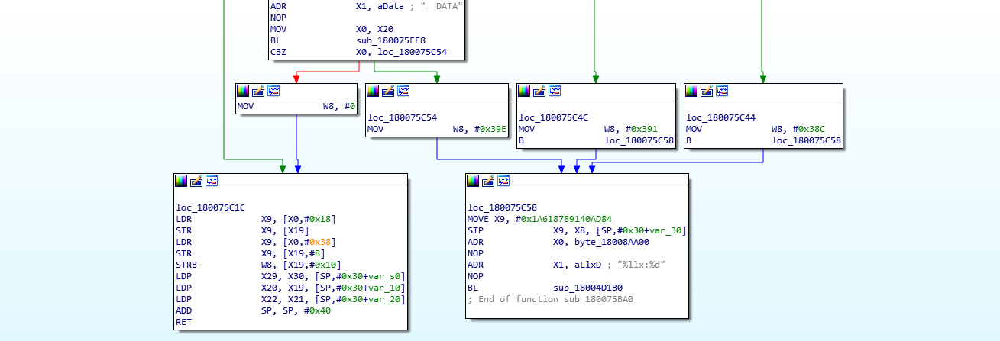
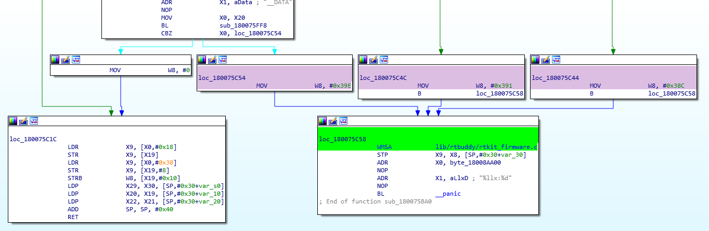

# WMSA: Where My Strings At?

Python plugin for converting HMAC'd strings in iBoot to valid file names for aiding iBoot Reverse Engineering.

# Explanation

Apple started obfuscating iBoot strings with iOS 9. They basically stripped down some printfs and (all?) panic/assert calls to be the file path wth some crypto magic and the line number of print/panic.

For example, This code in `SRC/iBoot/hax.c`:

```
12. ...
13. printf("Hello there\n");
14. ...
```

In the pseudo code in the compiled binary would be like:

```
printf("%llx:%d\n", 0x3974BFD3D441DA3, 13);
```

where `0x3974BFD3D441DA3` is the HMAC'd file path and `13` is the line number

What this plugin will bascially do is convert such disassembly:

<p align="center"></p>

Into:

<p align="center"></p>

# Notice

This script will only work on iBoots later than iOS 11.3 beta 3 where they changed the hashing stuff because an older version of iBoot src (iOS 9) was leaked which allowed decoding these hashes.
Another thing to know is this won't decode all hashes so contributions are highly accepted (especially from people who have latest DEV iBoots).

# Usage

Copy `WMSA.py` and `hash.plist` from this repo into `plugins` folder in IDA X.X folder or based on OS copy these paths and that's it:

## Mac/Linux

`~/.idapro/loaders/`

## Windows

`%APPDATA%\Hex-Rays\IDA Pro\plugins`

# Requirement

Xerub's [Simp7.py](https://github.com/xerub/idastuff/blob/master/arm64/Simp7.py) is necessary if using < IDA 7.2 but WMSA.py won't work on IDA 7.2 anyways.

# > IDA 7.0 Support

I actually don't know about writing IDA plugins. This one was written based on gluing stuff from here and there. So idk.